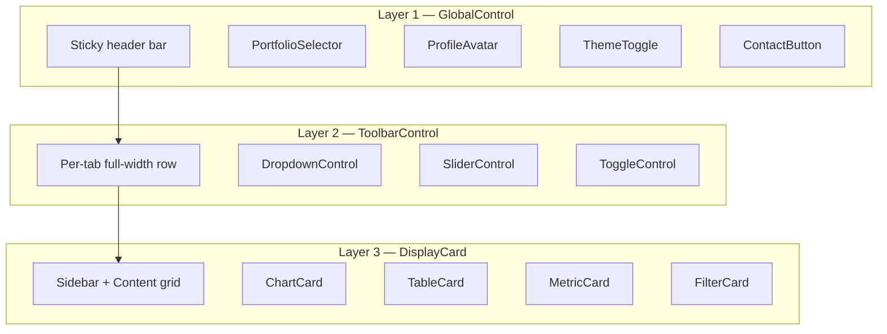

# IRIS-D Developer Guide

> Technical reference for extending the 3-layer modular dashboard framework.

---

## Architecture Overview

The dashboard is structured into three **independent, layered control surfaces**. Each layer follows the same pattern: **subclass → configure → register/return → framework auto-renders**.



### Key Files

| File | Purpose |
|---|---|
| `src/dashboard/tabs/registry.py` | `BaseTab`, `TabContext`, tab registry |
| `src/dashboard/components/cards.py` | `DisplayCard` hierarchy + `CallbackSpec` |
| `src/dashboard/components/controls.py` | `GlobalControl` hierarchy + registry |
| `src/dashboard/components/toolbar.py` | `ToolbarControl` presets |
| `src/dashboard/components/signals.py` | Cross-layer `dcc.Store` signal IDs |
| `src/dashboard/callbacks/__init__.py` | `CallbackRegistry` auto-wiring |
| `src/dashboard/utils/helpers.py` | Shared utilities (theme, wrappers, formatters) |

---

## Adding a New Tab

### Step 1: Create the tab file

```python
# src/dashboard/tabs/my_analysis.py

from dash import html, callback, Input, Output
from ..tabs.registry import BaseTab, TabContext, register_tab
from ..components.cards import ChartCard, TableCard, MetricCard, MetricItem, CardSize
from ..components.toolbar import DropdownControl, SliderControl
from ..components.signals import Signal
import plotly.graph_objects as go


class MyAnalysisTab(BaseTab):
    id = "my-analysis"           # URL-safe slug, used in HTML ids
    label = "My Analysis"         # Nav bar display text
    order = 50                    # Sort position (lower = further left)
    required_role = None          # None = visible to all, "admin" = admin-only

    # ── Layer 2: Toolbar (optional) ────────────────────────────────────────

    def get_toolbar_controls(self, ctx):
        return [
            DropdownControl(
                id="my-view-selector",
                label="View",
                options=[
                    {"label": "By Industry", "value": "industry"},
                    {"label": "By Region", "value": "region"},
                ],
                value="industry",
                order=10,
            ),
            SliderControl(
                id="my-lookback",
                label="Quarters",
                min_val=1, max_val=12, value=4,
                order=20,
            ),
        ]

    # ── Layer 3: Cards ─────────────────────────────────────────────────────

    def get_cards(self, ctx):
        return [
            MyKpiMetrics(),
            MyMainChart(),
            MyDataTable(),
        ]

    # ── Sidebar (optional) ─────────────────────────────────────────────────

    def render_sidebar(self, ctx):
        from ..utils.helpers import sidebar_wrapper, dropdown_filter
        return sidebar_wrapper("Filters", [
            dropdown_filter(
                id="my-industry-filter",
                label="Industry",
                options=[{"label": i, "value": i} for i in ["Tech", "Finance", "Healthcare"]],
                multi=True,
            ),
        ])

    # ── Callbacks ──────────────────────────────────────────────────────────

    def register_callbacks(self, app):
        # Tab-level callbacks (complex orchestration)
        pass


# Auto-register at import time
register_tab(MyAnalysisTab())
```

### Step 2: Register the tab for auto-discovery

Add the import to `src/dashboard/tabs/__init__.py`:

```python
from . import my_analysis  # noqa: F401
```

That's it — the framework auto-discovers and renders the tab.

### Step 3: Choose your content strategy

| Strategy | Method to override | When to use |
|---|---|---|
| **Declarative** (recommended) | `get_cards(ctx)` | Most tabs — compose from reusable cards |
| **Direct** | `render_content(ctx)` | Full manual control of content area |
| **Custom layout** | `render(ctx)` | Completely custom layout (e.g. 3-column) |

---

## Building Cards (Layer 3)

### ChartCard — Plotly charts

```python
class RevenueByQuarter(ChartCard):
    card_id = "revenue-by-quarter"   # unique HTML id
    title = "Revenue by Quarter"
    subtitle = "Last 8 quarters"
    size = CardSize.HALF              # FULL, HALF, or CUSTOM
    height = 350                      # chart height in pixels
    order = 10                        # sort position in the grid

    def build_figure(self, ctx: TabContext) -> go.Figure:
        """Build and return a Plotly figure.
        The framework auto-applies the IRIS-D theme via plotly_theme()."""
        df = ctx.get_filtered_data(ctx.selected_portfolio)
        fig = go.Figure()
        fig.add_trace(go.Bar(
            x=df["quarter"],
            y=df["revenue"],
            name="Revenue",
        ))
        return fig
```

### TableCard — DataTables

```python
class TopHoldings(TableCard):
    card_id = "top-holdings"
    title = "Top Holdings"
    size = CardSize.FULL
    max_rows = 15
    sortable = True
    filterable = True
    columns = [
        {"name": "Obligor", "id": "obligor_name"},
        {"name": "Balance", "id": "balance", "type": "numeric", "format": {"specifier": "$,.0f"}},
        {"name": "Rating", "id": "risk_rating", "type": "numeric"},
    ]

    def get_data(self, ctx: TabContext) -> pd.DataFrame:
        df = ctx.get_filtered_data(ctx.selected_portfolio)
        return df.nlargest(self.max_rows, "balance")[["obligor_name", "balance", "risk_rating"]]
```

### MetricCard — KPI summaries

```python
class PortfolioKpis(MetricCard):
    card_id = "portfolio-kpis"
    title = "Portfolio Overview"
    size = CardSize.FULL
    columns_count = 4
    order = 0   # display first

    def get_metrics(self, ctx: TabContext) -> list[MetricItem]:
        """Compute metrics dynamically from data."""
        df = ctx.get_filtered_data(ctx.selected_portfolio)
        total = df["balance"].sum()
        avg_rating = df["risk_rating"].mean()
        return [
            MetricItem(label="Total Balance", value=format_currency(total), icon="💰"),
            MetricItem(label="Facilities", value=f"{len(df):,}", icon="🏦"),
            MetricItem(label="Avg Rating", value=f"{avg_rating:.1f}", icon="📊"),
            MetricItem(
                label="QoQ Change",
                value="+2.3%",
                change="+$45M",
                change_positive=True,
                icon="📈",
            ),
        ]
```

### FilterCard — Sidebar filters

```python
class IndustryFilter(FilterCard):
    card_id = "industry-filter"
    filters = [
        FilterDef(id="ind-dropdown", label="Industry", multi=True,
                  placeholder="All industries..."),
        FilterDef(id="region-dropdown", label="Region",
                  options=[{"label": "US", "value": "US"}, {"label": "EU", "value": "EU"}]),
    ]
```

### Custom DisplayCard

For anything that doesn't fit the presets:

```python
class CustomWidget(DisplayCard):
    card_id = "custom-widget"
    title = "My Custom Widget"
    size = CardSize.HALF

    def render_body(self, ctx: TabContext):
        """Return ANY Dash component tree."""
        return html.Div([
            html.P("Custom content here"),
            dcc.Graph(id="custom-graph", figure=go.Figure()),
            html.Button("Click me", id="custom-btn"),
        ])
```

---

## Callback Architecture

### Pattern 1: Self-contained (within one class)

```python
class ThemeToggle(GlobalControl):
    id = "theme-toggle"

    def callback_specs(self):
        return [CallbackSpec(
            outputs=[("theme-toggle", "children")],
            inputs=[("theme-toggle", "n_clicks")],
            client_side="function(n){ /* toggle logic */ }",
        )]
```

### Pattern 2: Cross-layer (L1 → L3 via Signal)

Layer 1 control **writes** to a signal:
```python
class PortfolioSelector(GlobalControl):
    def callback_specs(self):
        return [CallbackSpec(
            outputs=[(Signal.PORTFOLIO, "data")],         # ← writes signal
            inputs=[("portfolio-selector-btn", "n_clicks")],
            handler=self._on_select,
        )]
```

Layer 3 card **reads** the same signal:
```python
class MyChart(ChartCard):
    def callback_specs(self):
        return [CallbackSpec(
            outputs=[("my-chart", "children")],
            inputs=[(Signal.PORTFOLIO, "data")],          # ← reads signal
            handler=self._rebuild,
        )]
```

### Pattern 3: Cross-card (sidebar → chart via tab signal)

```python
# Sidebar filter writes to a tab-scoped signal
class IndustryFilter(FilterCard):
    def callback_specs(self):
        return [CallbackSpec(
            outputs=[(Signal.tab_filter("my-tab"), "data")],
            inputs=[("industry-dropdown", "value")],
            handler=self._on_filter,
        )]

# Chart reads from that same signal
class MyChart(ChartCard):
    def callback_specs(self):
        return [CallbackSpec(
            outputs=[("my-chart", "children")],
            inputs=[(Signal.tab_filter("my-tab"), "data")],
            handler=self._rebuild,
        )]
```

### Pattern 4: Multi-layer (card reads from L1 + L2 + L3 + self)

A single card can subscribe to inputs from **all layers simultaneously**:

```python
class ComplexChart(ChartCard):
    card_id = "complex-chart"

    def callback_specs(self):
        return [CallbackSpec(
            outputs=[("complex-chart-body", "children")],
            inputs=[
                (Signal.PORTFOLIO, "data"),                        # Layer 1
                (Signal.tab_filter("my-tab"), "data"),             # Layer 2
                ("sidebar-industry-dropdown", "value"),            # Layer 3 sidebar
                ("complex-chart-metric-toggle", "value"),          # Layer 3 self
            ],
            handler=self._rebuild,
        )]

    def _rebuild(self, portfolio, tab_filters, industry, metric_toggle):
        """Dash fires this when ANY input changes, passing all current values."""
        # portfolio       → str from Layer 1
        # tab_filters     → dict from Layer 2 toolbar
        # industry        → list from Layer 3 sidebar
        # metric_toggle   → str from this card's inline control
        ...
```

### Using Traditional `register_callbacks()`

For complex orchestration or when you prefer the traditional Dash pattern, use `register_callbacks()` on the tab:

```python
class MyTab(BaseTab):
    def register_callbacks(self, app):
        @callback(
            Output("my-output", "children"),
            Input("my-input", "value"),
        )
        def my_handler(value):
            return f"Selected: {value}"
```

Both `callback_specs()` and `register_callbacks()` work together — the `CallbackRegistry` handles both.

---

## Adding Custom Metrics

### In a MetricCard

```python
from ..utils.helpers import format_currency, format_percent

class RiskMetrics(MetricCard):
    card_id = "risk-metrics"
    title = "Risk Summary"

    def get_metrics(self, ctx):
        df = ctx.get_filtered_data(ctx.selected_portfolio)

        # Weighted Average Risk Factor (WARF)
        warf = (df["risk_rating"] * df["balance"]).sum() / df["balance"].sum()

        # Debt Service Coverage Ratio (DSCR)
        dscr = df["dscr"].mean()

        # Loss Given Default (LGD)
        defaulted = df[df["risk_category"] == "Defaulted"]
        lgd = defaulted["loss"].sum() / defaulted["balance"].sum() if len(defaulted) > 0 else 0

        return [
            MetricItem(label="WARF", value=f"{warf:.1f}", icon="⚠️"),
            MetricItem(label="DSCR", value=f"{dscr:.2f}x", icon="📐"),
            MetricItem(label="LGD", value=format_percent(lgd), icon="🔻",
                       change_positive=False if lgd > 0.3 else True),
            MetricItem(label="Total Exposure", value=format_currency(df["balance"].sum()), icon="💵"),
        ]
```

### In a ChartCard

```python
class WARFTrendChart(ChartCard):
    card_id = "warf-trend"
    title = "WARF Over Time"
    height = 350

    def build_figure(self, ctx):
        df = ctx.facilities_df
        portfolio_config = ctx.portfolios.get(ctx.selected_portfolio, {})

        # Group by quarter and compute weighted metric
        quarterly = df.groupby("report_quarter").apply(
            lambda g: (g["risk_rating"] * g["balance"]).sum() / g["balance"].sum()
        ).reset_index(name="warf")

        fig = go.Figure()
        fig.add_trace(go.Scatter(
            x=quarterly["report_quarter"],
            y=quarterly["warf"],
            mode="lines+markers",
            name="WARF",
            line=dict(color="#8b5cf6", width=2),
        ))
        fig.update_layout(yaxis_title="WARF")
        return fig
```

---

## Adding Global Controls (Layer 1)

```python
# src/dashboard/components/controls.py (add at bottom)

class NotificationBell(GlobalControl):
    id = "notification-bell"
    label = "Notifications"
    position = ControlPosition.RIGHT
    order = 15  # between ProfileAvatar (20) and ThemeToggle (30)

    def render(self, **kwargs):
        return html.Button("🔔", id=self.id, n_clicks=0,
                          className="header-btn", title="Notifications")

    def callback_specs(self):
        return [CallbackSpec(
            outputs=[("notification-panel", "style")],
            inputs=[("notification-bell", "n_clicks")],
            handler=self._toggle_panel,
            prevent_initial_call=True,
        )]

    @staticmethod
    def _toggle_panel(n_clicks):
        if n_clicks and n_clicks % 2:
            return {"display": "block"}
        return {"display": "none"}

register_global_control(NotificationBell())
```

---

## Adding Toolbar Controls (Layer 2)

Built-in presets:

| Class | What it renders | Key params |
|---|---|---|
| `DropdownControl` | `dcc.Dropdown` | `options`, `value`, `multi` |
| `SliderControl` | `dcc.Slider` | `min_val`, `max_val`, `step`, `marks` |
| `ToggleControl` | `dcc.Checklist` as toggle | `default` (bool) |

Custom toolbar control:

```python
from ..components.toolbar import ToolbarControl

class DateRangePicker(ToolbarControl):
    id = "date-range"
    label = "Date Range"
    order = 30

    def __init__(self, start_date=None, end_date=None, **kwargs):
        self.start_date = start_date
        self.end_date = end_date

    def render(self, ctx):
        return html.Div([
            html.Label(self.label, className="block text-xs font-medium mb-1"),
            dcc.DatePickerRange(
                id=self.id,
                start_date=self.start_date,
                end_date=self.end_date,
            ),
        ], className="min-w-[240px]")
```

---

## Shared Utilities

Import from `src/dashboard/utils/helpers.py`:

```python
from ..utils.helpers import (
    plotly_theme,       # dict for fig.update_layout(**plotly_theme(height=400))
    empty_figure,       # placeholder figure with message
    card_wrapper,       # standard card shell div
    card_header,        # title + subtitle bar
    sidebar_wrapper,    # standard sidebar shell
    toolbar_row,        # toolbar row wrapper
    dropdown_filter,    # labeled dcc.Dropdown builder
    format_currency,    # $2.5M, $950K
    format_percent,     # 12.3%
    format_metric_name, # "warf" → "WARF", "avg_balance" → "Avg Balance"
)
```

---

## TabContext Reference

Every render method receives a `TabContext` with these attributes:

| Attribute | Type | Description |
|---|---|---|
| `selected_portfolio` | `str` | Currently active portfolio name |
| `available_portfolios` | `list[str]` | All portfolio names |
| `portfolios` | `dict` | Portfolio config (LOB filters, metrics) |
| `facilities_df` | `DataFrame` | Full facilities dataset (all quarters) |
| `latest_facilities` | `DataFrame` | Latest quarter only |
| `custom_metrics` | `dict` | User-defined custom metric formulas |
| `get_filtered_data` | `callable` | `get_filtered_data(portfolio_name) → DataFrame` |

---

## Signal Reference

| Signal ID | Written by | Read by | Value type |
|---|---|---|---|
| `Signal.PORTFOLIO` | `PortfolioSelector` (L1) | Any card | `str` |
| `Signal.USER` | Auth system (L1) | Any card | `str` |
| `Signal.tab_filter(tab_id)` | Toolbar controls (L2) | Cards in that tab | `dict` |

---

## File Organization

```
src/dashboard/
├── tabs/                        # Self-contained tab modules
│   ├── registry.py              # BaseTab, TabContext, register_tab()
│   ├── __init__.py              # Auto-imports all tab modules
│   ├── portfolio_summary.py     # Portfolio summary (charts, watchlist, sidebar, CRUD)
│   ├── holdings.py              # Holdings (table, time-series expansion)
│   ├── financial_trend.py       # Financial trends (details table, filters)
│   ├── portfolio_trend.py       # Portfolio trends (benchmark charts)
│   ├── vintage_analysis.py      # Vintage analysis (cohort charts)
│   └── role_tabs.py             # Role-gated: SIR, Location, Projection, Backtesting
├── components/                  # Shared UI framework ONLY (no tab-specific code)
│   ├── cards.py                 # DisplayCard, ChartCard, TableCard, MetricCard, FilterCard
│   ├── controls.py              # GlobalControl, PortfolioSelector, ThemeToggle, ...
│   ├── toolbar.py               # ToolbarControl, DropdownControl, SliderControl, ...
│   ├── signals.py               # Signal IDs for cross-layer dcc.Store
│   └── layout.py                # Main app shell (header, content, modals)
├── callbacks/
│   └── __init__.py              # CallbackRegistry
├── utils/
│   └── helpers.py               # Plotly theme, wrappers, formatters
└── app.py                       # App initialization, data loading, callback setup
```
