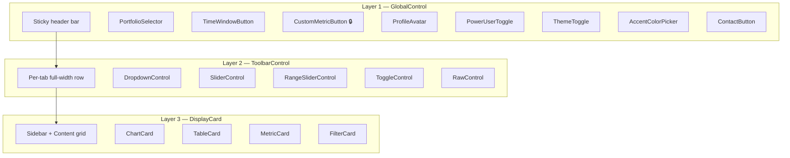

# IRIS-D Developer Guide

> Technical reference for extending the 3-layer modular dashboard framework.

---

## Architecture Overview

The dashboard is structured into three **independent, layered control surfaces**. Each layer follows the same pattern: **subclass → configure → register/return → framework auto-renders**.



### Key Files

| File | Purpose |
|---|---|
| `src/dashboard/app.py` | Slim orchestrator — app init, tab navigation callback, callback wiring |
| `src/dashboard/app_state.py` | `AppState` singleton — all mutable state, time window, filtering |
| `src/dashboard/tabs/registry.py` | `BaseTab`, `TabContext`, tab registry |
| `src/dashboard/data/dataset.py` | `Dataset` — generic dataset with filtering + caching |
| `src/dashboard/data/registry.py` | `DatasetRegistry` — global dataset access |
| `src/dashboard/data/sources.py` | `DataSource` protocol + `SqliteDataSource` + `InMemoryDataSource` |
| `src/dashboard/data/loader.py` | `load_dataset()` facade |
| `src/dashboard/components/cards.py` | `DisplayCard` hierarchy + `CallbackSpec` |
| `src/dashboard/components/controls.py` | `GlobalControl` hierarchy + registry |
| `src/dashboard/components/toolbar.py` | `ToolbarControl` presets |
| `src/dashboard/components/signals.py` | Cross-layer `dcc.Store` signal IDs |
| `src/dashboard/components/layout.py` | App shell (header, content, modals, stores) |
| `src/dashboard/components/mixins/click_detail.py` | Click-to-detail chart drill-down (reusable) |
| `src/dashboard/callbacks/__init__.py` | `CallbackRegistry` auto-wiring |
| `src/dashboard/callbacks/user_callbacks.py` | Login, register, delete-profile, profile-switch |
| `src/dashboard/callbacks/portfolio_callbacks.py` | Portfolio CRUD (create, select, update, delete) |
| `src/dashboard/callbacks/time_window_callbacks.py` | Time window modal, apply, reset, performance warning |
| `src/dashboard/utils/helpers.py` | Shared utilities (theme, wrappers, formatters) |

---

## State Management

All mutable state lives in a single `AppState` singleton in `app_state.py`.

### Key AppState API

```python
from .app_state import app_state

# Data access
ctx = app_state.make_tab_context("Corporate Banking")  # TabContext for rendering
df  = app_state.get_filtered_data("CRE")               # latest snapshot, portfolio-filtered
df  = app_state.get_filtered_data_windowed("CRE", n_periods=12)

# Time window
app_state.set_time_window("2024-01-31", "2026-01-31")  # ISO date strings
start, end = app_state.get_time_window()
min_date, max_date = app_state.get_available_date_range()
windowed_df = app_state._apply_time_window(app_state.facilities_df)

# Control value store (see "Control Value Store" section below)
app_state.set_control_value("ps-segmentation", "industry")
val = app_state.get_control_value("ps-segmentation", default=None)
app_state.register_control("ps-segmentation", preserve=True)
app_state.clear_transient_controls()  # called automatically on global changes

# User management
app_state.load_user_portfolios(username)   # on login/switch
app_state.save_user_data(username)         # on portfolio CRUD / autosave
```

### Time Window Behavior

The global time window filters data throughout the app:

- `make_tab_context()` passes **time-windowed** `facilities_df` to tabs. This means `ctx.facilities_df` only contains data within the active window.
- `get_filtered_data()` returns the **latest snapshot within the window**, filtered by portfolio criteria.
- When no time window is set (`None, None`), the full dataset is used.
- Default time window on startup: **last 2 years**.

### Properties

| Property | Type | Description |
|---|---|---|
| `facilities_df` | `pl.DataFrame` | Full facilities dataset (delegates to `Dataset.full_df`) |
| `latest_facilities` | `pl.DataFrame` | Latest quarter snapshot (delegates to `Dataset.latest_df`) |
| `portfolios` | `dict` | Portfolio definitions `{name: {"filters": [...]}}` |
| `custom_metrics` | `dict` | User-defined metric formulas `{name: {"dataset", "tokens", "metric_type"}}` where `metric_type` is `"numeric"`, `"categorical"`, or `"indicator"` |
| `available_portfolios` | `list[str]` | All portfolio names |
| `default_portfolio` | `str` | Default portfolio name (`"Entire Commercial"`) |

### Control Value Store

AppState includes a centralized store for tab control values with an opt-in `preserve` flag. By default, control values are **transient** — they are cleared when global state changes (portfolio switch, time window, custom metric). Controls registered with `preserve=True` survive these resets.

**How it works:**

1. **Tab renders** → control reads its value via `app_state.get_control_value(id, default)`
2. **User interacts** → callback stores via `app_state.set_control_value(id, value)`
3. **Global change fires** → `route_tabs` calls `app_state.clear_transient_controls()` → transient values removed → tab re-renders → preserved controls keep their value, transient controls fall back to their hardcoded default

**API:**

| Method | Description |
|---|---|
| `set_control_value(id, value)` | Store a control's current value |
| `get_control_value(id, default=None)` | Read a stored value (falls back to *default*) |
| `register_control(id, preserve=True)` | Mark a control as preserved across global resets |
| `clear_transient_controls()` | Remove all non-preserved values (called automatically by `route_tabs`) |

**Example — card-level control (transient by default):**

```python
# In render_content():
seg = app_state.get_control_value("ps-segmentation")  # None after global change

# In callback:
app_state.set_control_value("ps-segmentation", segmentation)
```

**Example — making a control preserved:**

```python
# In render_content() — one line to opt in:
app_state.register_control("ps-segmentation", preserve=True)
seg = app_state.get_control_value("ps-segmentation")  # survives portfolio switches
```

**Toolbar controls** support `preserve` as a constructor parameter. When `preserve=True`, the control auto-registers itself and reads from the store during `render()`:

```python
DropdownControl(
    id="my-metric", label="Metric",
    options=[...], value="balance",
    preserve=True,  # value survives global state changes
)
```

---

## Adding a New Tab

### Step 1: Create the tab file

Copy `src/dashboard/tabs/_template.py` or create a new file:

```python
# src/dashboard/tabs/my_analysis.py

from dash import html, dcc, callback, Input, Output
import plotly.graph_objs as go
import polars as pl

from ..tabs.registry import BaseTab, TabContext, register_tab
from ..components.cards import ChartCard, TableCard, MetricCard, MetricItem, CardSize
from ..components.toolbar import DropdownControl


class MyAnalysisTab(BaseTab):
    id = "my-analysis"           # URL-safe slug, used in HTML ids
    label = "My Analysis"         # Nav bar display text
    order = 50                    # Sort position (lower = further left)
    required_roles = None         # None = visible to all, ["SAG"] = SAG-only

    # ── Layer 2: Toolbar (optional) ────────────────────────────────────────

    def get_toolbar_controls(self, ctx: TabContext):
        return [
            DropdownControl(
                id="my-view-selector",
                label="View",
                options=[
                    {"label": "By Industry", "value": "industry"},
                    {"label": "By Region", "value": "msa"},
                ],
                value="industry",
                order=10,
            ),
        ]

    # ── Layer 3: Cards (declarative approach) ──────────────────────────────

    def get_cards(self, ctx: TabContext):
        return [
            MyKpiMetrics(),
            MyMainChart(),
            MyDataTable(),
        ]

    # ── Sidebar (optional) ─────────────────────────────────────────────────

    def render_sidebar(self, ctx: TabContext):
        from ..utils.helpers import sidebar_wrapper, dropdown_filter
        return sidebar_wrapper("Filters", [
            dropdown_filter(
                id="my-industry-filter",
                label="Industry",
                options=[{"label": i, "value": i}
                         for i in ctx.facilities_df["industry"].unique().sort().to_list()],
                multi=True,
            ),
        ])

    # ── Callbacks ──────────────────────────────────────────────────────────

    def register_callbacks(self, app):
        from ..app_state import app_state

        @callback(
            Output("my-chart-container", "children"),
            [Input("my-view-selector", "value"),
             Input("universal-portfolio-dropdown", "value"),
             Input("time-window-store", "data")],
            prevent_initial_call=True,
        )
        def update_chart(view, portfolio, _tw):
            sel = portfolio or app_state.default_portfolio
            df = app_state._apply_time_window(app_state.facilities_df)
            # ... build chart using view and df ...
            return dcc.Graph(figure=go.Figure())


# Auto-register at import time — auto-discovery handles the rest
register_tab(MyAnalysisTab())
```

### Step 2: That's it

Tab auto-discovery in `tabs/__init__.py` automatically imports all non-`_` prefixed files in the `tabs/` directory. No need to edit any other file.

### Step 3: Choose your content strategy

| Strategy | Method to override | When to use |
|---|---|---|
| **Declarative** (recommended) | `get_cards(ctx)` | Most tabs — compose from reusable cards |
| **Direct** | `render_content(ctx)` | Full manual control of content area |
| **Custom layout** | `render(ctx)` | Completely custom layout (e.g. multi-column) |

#### Render Call Hierarchy

```
render(ctx)
├── get_toolbar_controls(ctx)  → Layer 2 (full-width row above content)
├── render_sidebar(ctx)        → Layer 3 (optional left panel)
└── render_content(ctx)        → Layer 3 main area
    └── get_cards(ctx)         → declarative card grid (if render_content not overridden)
```

---

## Complete Tab Example: Concentration Analysis

Here is a full, working tab that demonstrates all three layers:

```python
# src/dashboard/tabs/concentration.py
"""
Concentration Analysis tab — shows portfolio concentration by various dimensions.
"""

from dash import html, dcc, callback, Input, Output, no_update
import plotly.graph_objs as go
import polars as pl

from ..tabs.registry import BaseTab, TabContext, register_tab
from ..components.toolbar import DropdownControl


class ConcentrationTab(BaseTab):
    id = "concentration"
    label = "Concentration"
    order = 35

    # ── Layer 2: Toolbar ────────────────────────────────────────────────────

    def get_toolbar_controls(self, ctx: TabContext):
        return [
            DropdownControl(
                id="concentration-dimension",
                label="Group By",
                options=[
                    {"label": "Industry", "value": "industry"},
                    {"label": "Risk Category", "value": "risk_category"},
                    {"label": "LOB", "value": "lob"},
                ],
                value="industry",
                order=10,
            ),
            DropdownControl(
                id="concentration-metric",
                label="Metric",
                options=[
                    {"label": "Balance", "value": "balance"},
                    {"label": "Facility Count", "value": "count"},
                ],
                value="balance",
                order=20,
            ),
        ]

    # ── Layer 3: Content (direct approach) ──────────────────────────────────

    def render_content(self, ctx: TabContext):
        """Render a pie chart + summary table side by side."""
        df = ctx.get_filtered_data(ctx.selected_portfolio)

        # Build initial pie chart
        fig = _build_concentration_chart(df, "industry", "balance")

        return html.Div([
            # Chart
            html.Div([
                html.Div([
                    html.H3("Concentration Breakdown",
                            className="text-sm font-semibold text-ink-800 dark:text-slate-200 mb-2"),
                    dcc.Graph(id="concentration-chart", figure=fig,
                              config={"displayModeBar": False}),
                ], className="bg-white dark:bg-ink-800 rounded-xl shadow-soft "
                             "border border-slate-200 dark:border-ink-700 p-4"),
            ], className="col-span-2"),

            # Summary stats
            html.Div([
                html.Div([
                    html.H3("Summary",
                            className="text-sm font-semibold text-ink-800 dark:text-slate-200 mb-2"),
                    html.Div(id="concentration-summary"),
                ], className="bg-white dark:bg-ink-800 rounded-xl shadow-soft "
                             "border border-slate-200 dark:border-ink-700 p-4"),
            ], className="col-span-1"),
        ], className="grid grid-cols-3 gap-4")

    # ── Callbacks ──────────────────────────────────────────────────────────

    def register_callbacks(self, app):
        from ..app_state import app_state

        @callback(
            [Output("concentration-chart", "figure"),
             Output("concentration-summary", "children")],
            [Input("concentration-dimension", "value"),
             Input("concentration-metric", "value"),
             Input("universal-portfolio-dropdown", "value"),
             Input("time-window-store", "data")],
            prevent_initial_call=False,
        )
        def update_concentration(dimension, metric, portfolio, _tw):
            sel = portfolio or app_state.default_portfolio
            df = app_state.get_filtered_data(sel)
            if df.is_empty():
                return go.Figure(), html.P("No data available.")

            fig = _build_concentration_chart(df, dimension, metric)

            # Summary stats
            n_groups = df[dimension].n_unique()
            top_group = (
                df.group_by(dimension)
                .agg(pl.col("balance").sum())
                .sort("balance", descending=True)
                .head(1)
                .row(0, named=True)
            )
            summary = html.Div([
                html.P(f"Groups: {n_groups}", className="text-sm mb-1"),
                html.P(f"Top: {top_group[dimension]}",
                       className="text-sm mb-1"),
                html.P(f"Balance: ${top_group['balance']:,.0f}",
                       className="text-sm font-semibold"),
            ])

            return fig, summary


def _build_concentration_chart(df, dimension, metric):
    """Build a pie chart for the given dimension and metric."""
    if metric == "count":
        grouped = df.group_by(dimension).agg(pl.len().alias("value"))
    else:
        grouped = df.group_by(dimension).agg(
            pl.col("balance").sum().alias("value")
        )

    fig = go.Figure(data=[go.Pie(
        labels=grouped[dimension].to_list(),
        values=grouped["value"].to_list(),
        hole=0.4,
        textinfo="label+percent",
    )])
    fig.update_layout(
        plot_bgcolor="rgba(0,0,0,0)",
        paper_bgcolor="rgba(0,0,0,0)",
        font=dict(color="rgba(255,255,255,0.7)"),
        margin=dict(l=20, r=20, t=20, b=20),
        height=400,
        showlegend=False,
    )
    return fig


register_tab(ConcentrationTab())
```

### Adding Click-to-Detail Drill-Down

Any chart can be enhanced with a click-to-detail panel using `components/mixins/click_detail.py`. Clicking a chart element (bar, point, segment) shows a detail table below the chart with matching rows. The clicked element is highlighted while others dim to 25% opacity.

#### Quick Setup (3 steps)

```python
from ..components.mixins.click_detail import chart_with_detail_layout, register_detail_callback

class MyTab(BaseTab):
    def render_content(self, ctx):
        fig = _build_my_chart(...)
        # Step 1: Replace dcc.Graph with the wrapper
        return html.Div([
            chart_with_detail_layout("my-chart", figure=fig, height=400),
        ], className="glass-card p-4")

    def register_callbacks(self, app):
        from ..app_state import app_state
        from dash import State as DashState

        # Step 2: Define a detail function
        def _get_detail(click_point, curve_name, x_value, portfolio):
            # click_point: clickData["points"][0]
            # curve_name: from customdata (preferred) or curveNumber
            # x_value: str(point["x"])
            # portfolio: from extra_states
            df = ...  # filter your data based on x_value and curve_name
            return df  # pl.DataFrame, or None to hide the panel

        # Step 3: Register the callback
        register_detail_callback(
            app, "my-chart", detail_fn=_get_detail,
            extra_states=[DashState("universal-portfolio-dropdown", "value")],
        )
```

#### API Reference

**`chart_with_detail_layout(graph_id, figure, height, detail_max_rows)`**

Returns a `html.Div` containing:
- `dcc.Store` for toggle state
- `dcc.Graph` with the chart
- Hidden detail panel with header (title + close button) and `DataTable`

| Parameter | Type | Default | Description |
|---|---|---|---|
| `graph_id` | `str` | required | Unique ID for the graph (used as prefix for all sub-component IDs) |
| `figure` | `go.Figure` | `None` | Initial Plotly figure |
| `height` | `int` | `400` | Chart height in pixels |
| `detail_max_rows` | `int` | `200` | Max rows shown in the detail table |

**`register_detail_callback(app, graph_id, detail_fn, title_fn, extra_states)`**

Wires `clickData` on the graph to the detail panel.

| Parameter | Type | Default | Description |
|---|---|---|---|
| `app` | `Dash` | required | The Dash app instance |
| `graph_id` | `str` | required | Must match the ID passed to `chart_with_detail_layout` |
| `detail_fn` | `callable` | required | `(click_point, curve_name, x_value, *extra) -> pl.DataFrame \| None` |
| `title_fn` | `callable` | `None` | `(click_point, curve_name, x_value) -> str`. Default: `"Details for {x} — {curve}"` |
| `extra_states` | `list[State]` | `None` | Additional `State(...)` objects forwarded to `detail_fn` as extra positional args |

#### Interaction Behavior

- **Click element** → detail table slides in, clicked element highlighted, others dimmed
- **Click same element** → toggle: table hides, opacity restored
- **Click different element** → table updates, highlight moves
- **Close button (✕)** → table hides, opacity restored

#### Important: Set `customdata` on Traces

The callback extracts the trace/curve name from `clickData`. Plotly doesn't reliably include the trace name, so **set `customdata`** on each trace:

```python
fig.add_trace(go.Bar(
    x=periods, y=values,
    name="Segment A",
    customdata=[["Segment A"] for _ in periods],  # ← required for drill-down
))
```

#### CSS Classes

The detail panel uses these CSS classes (defined in `assets/style.css`):

| Class | Purpose |
|---|---|
| `.detail-chart-wrapper` | Flex column container, constrains width |
| `.detail-panel` | Hidden by default, glassmorphism background |
| `.detail-panel__header` | Flex row: title + close button |
| `.detail-panel__title` | 13px bold title |
| `.detail-panel__close` | ✕ close button |
| `@keyframes detail-slide-in` | 0.2s slide-in animation |

---

### Key patterns demonstrated above:

1. **Toolbar controls** react to user input via standard Dash `Input()`
2. **`universal-portfolio-dropdown`** and **`time-window-store`** are global inputs — include them to react to portfolio and time window changes
3. **`app_state.get_filtered_data()`** returns the latest snapshot within the active time window, filtered by portfolio
4. **`prevent_initial_call=False`** ensures the callback fires on page load
5. **Polars** used throughout — `group_by()`, `agg()`, `n_unique()`, `is_empty()`

---

## Building Cards (Layer 3)

### ChartCard — Plotly charts

```python
class RevenueByQuarter(ChartCard):
    card_id = "revenue-by-quarter"   # unique HTML id
    title = "Revenue by Quarter"
    subtitle = "Last 8 quarters"
    size = CardSize.HALF              # FULL, HALF, THIRD, QUARTER, CUSTOM
    height = 350                      # chart height in pixels
    order = 10                        # sort position in the grid

    def build_figure(self, ctx: TabContext) -> go.Figure:
        """Build and return a Plotly figure.
        The framework auto-applies the IRIS-D theme via plotly_theme()."""
        df = ctx.get_filtered_data(ctx.selected_portfolio)
        fig = go.Figure()
        fig.add_trace(go.Bar(
            x=df["reporting_date"].to_list(),
            y=df["balance"].to_list(),
            name="Balance",
        ))
        fig.update_layout(
            plot_bgcolor="rgba(0,0,0,0)",
            paper_bgcolor="rgba(0,0,0,0)",
            font=dict(color="rgba(255,255,255,0.7)"),
        )
        return fig
```

### TableCard — DataTables

```python
class TopHoldings(TableCard):
    card_id = "top-holdings"
    title = "Top Holdings"
    size = CardSize.FULL
    max_rows = 15
    sortable = True
    filterable = True
    columns = [
        {"name": "Obligor", "id": "obligor_name"},
        {"name": "Balance", "id": "balance", "type": "numeric",
         "format": {"specifier": "$,.0f"}},
        {"name": "Rating", "id": "risk_rating", "type": "numeric"},
    ]

    def get_data(self, ctx: TabContext) -> pl.DataFrame:
        df = ctx.get_filtered_data(ctx.selected_portfolio)
        return (df.sort("balance", descending=True)
                  .head(self.max_rows)
                  .select(["obligor_name", "balance", "risk_rating"]))
```

### MetricCard — KPI summaries

```python
class PortfolioKpis(MetricCard):
    card_id = "portfolio-kpis"
    title = "Portfolio Overview"
    size = CardSize.FULL
    columns_count = 4
    order = 0   # display first

    def get_metrics(self, ctx: TabContext) -> list[MetricItem]:
        df = ctx.get_filtered_data(ctx.selected_portfolio)
        total = df["balance"].sum()
        avg_rating = df["risk_rating"].mean()
        return [
            MetricItem(label="Total Balance", value=f"${total:,.0f}", icon="$"),
            MetricItem(label="Facilities", value=f"{len(df):,}"),
            MetricItem(label="Avg Rating", value=f"{avg_rating:.1f}"),
            MetricItem(
                label="QoQ Change",
                value="+2.3%",
                change="+$45M",
                change_positive=True,
            ),
        ]
```

### FilterCard — Sidebar filters

```python
class IndustryFilter(FilterCard):
    card_id = "industry-filter"
    filters = [
        FilterDef(id="ind-dropdown", label="Industry", multi=True,
                  placeholder="All industries..."),
        FilterDef(id="region-dropdown", label="Region",
                  options=[{"label": "US", "value": "US"},
                           {"label": "EU", "value": "EU"}]),
    ]
```

### Custom DisplayCard

For anything that doesn't fit the presets:

```python
class CustomWidget(DisplayCard):
    card_id = "custom-widget"
    title = "My Custom Widget"
    size = CardSize.HALF

    def render_body(self, ctx: TabContext):
        """Return ANY Dash component tree."""
        return html.Div([
            html.P("Custom content here"),
            dcc.Graph(id="custom-graph", figure=go.Figure()),
            html.Button("Click me", id="custom-btn"),
        ])
```

---

## Callback Architecture

### Callback Modules

Callbacks are organized by concern in `src/dashboard/callbacks/`:

| Module | Purpose |
|---|---|
| `user_callbacks.py` | Login, register, delete-profile, profile-switch |
| `portfolio_callbacks.py` | Portfolio CRUD (create, select, update, delete with confirmation) |
| `time_window_callbacks.py` | Time window modal open/close, apply, reset, performance warning |
| `__init__.py` | `CallbackRegistry` — auto-wires `CallbackSpec` instances from controls/cards |

Each module exports a `register(app)` function called at startup in `app.py`.

### Reacting to Global State Changes

Tabs and callbacks should subscribe to these global inputs to stay in sync:

| Input | ID | Property | When it fires |
|---|---|---|---|
| Portfolio change | `universal-portfolio-dropdown` | `value` | User selects a portfolio |
| Time window change | `time-window-store` | `data` | User applies a time window |
| Tab switch | `tab-{tab_id}` | `n_clicks` | User clicks a tab |

**Example — callback that reacts to portfolio and time window:**

```python
@callback(
    Output("my-output", "children"),
    [Input("universal-portfolio-dropdown", "value"),
     Input("time-window-store", "data")],
    prevent_initial_call=True,
)
def update_content(portfolio, _tw):
    from ..app_state import app_state
    sel = portfolio or app_state.default_portfolio
    df = app_state.get_filtered_data(sel)  # already time-windowed
    # ... render content ...
```

### Pattern 1: Self-contained (within one class)

```python
class ThemeToggle(GlobalControl):
    id = "theme-toggle"

    def callback_specs(self):
        return [CallbackSpec(
            outputs=[("theme-toggle", "children")],
            inputs=[("theme-toggle", "n_clicks")],
            client_side="function(n){ /* toggle logic */ }",
        )]
```

### Pattern 2: Cross-layer (L1 → L3 via Signal)

Layer 1 control **writes** to a signal:
```python
class PortfolioSelector(GlobalControl):
    def callback_specs(self):
        return [CallbackSpec(
            outputs=[(Signal.PORTFOLIO, "data")],
            inputs=[("portfolio-selector-btn", "n_clicks")],
            handler=self._on_select,
        )]
```

Layer 3 card **reads** the same signal:
```python
class MyChart(ChartCard):
    def callback_specs(self):
        return [CallbackSpec(
            outputs=[("my-chart", "children")],
            inputs=[(Signal.PORTFOLIO, "data")],
            handler=self._rebuild,
        )]
```

### Pattern 3: Cross-card (sidebar → chart via tab signal)

```python
# Sidebar filter writes to a tab-scoped signal
class IndustryFilter(FilterCard):
    def callback_specs(self):
        return [CallbackSpec(
            outputs=[(Signal.tab_filter("my-tab"), "data")],
            inputs=[("industry-dropdown", "value")],
            handler=self._on_filter,
        )]

# Chart reads from that same signal
class MyChart(ChartCard):
    def callback_specs(self):
        return [CallbackSpec(
            outputs=[("my-chart", "children")],
            inputs=[(Signal.tab_filter("my-tab"), "data")],
            handler=self._rebuild,
        )]
```

### Pattern 4: Traditional `register_callbacks()`

For complex orchestration or when you prefer the standard Dash pattern:

```python
class MyTab(BaseTab):
    def register_callbacks(self, app):
        @callback(
            Output("my-output", "children"),
            Input("my-input", "value"),
        )
        def my_handler(value):
            return f"Selected: {value}"
```

Both `callback_specs()` and `register_callbacks()` work together — the `CallbackRegistry` handles both.

---

## Adding Global Controls (Layer 1)

```python
# src/dashboard/components/controls.py (add at bottom, before registrations)

class NotificationBell(GlobalControl):
    id = "notification-bell"
    label = "Notifications"
    position = ControlPosition.RIGHT
    order = 15  # between ProfileAvatar (20) and ThemeToggle (30)

    def render(self, **kwargs):
        return html.Button("🔔", id=self.id, n_clicks=0,
                          className="header-btn", title="Notifications")

    def callback_specs(self):
        return [CallbackSpec(
            outputs=[("notification-panel", "style")],
            inputs=[("notification-bell", "n_clicks")],
            handler=self._toggle_panel,
            prevent_initial_call=True,
        )]

    @staticmethod
    def _toggle_panel(n_clicks):
        if n_clicks and n_clicks % 2:
            return {"display": "block"}
        return {"display": "none"}

register_global_control(NotificationBell())
```

### Existing Global Controls

| Control | ID | Position | Order | Description |
|---|---|---|---|---|
| `PortfolioSelector` | `portfolio-selector` | LEFT | 10 | Portfolio dropdown |
| `TimeWindowButton` | `time-window` | LEFT | 15 | Time window picker |
| `CustomMetricButton` | `custom-metric` | LEFT | 20 | Custom metric builder (power user gated) |
| `ProfileAvatar` | `profile-avatar` | RIGHT | 20 | User profile switcher |
| `PowerUserToggle` | `power-user-toggle` | RIGHT | 25 | Toggles power user mode on/off |
| `ThemeToggle` | `theme-toggle` | RIGHT | 30 | Light/dark mode |
| `AccentColorPicker` | `accent-color-picker` | RIGHT | 31 | Accent color cycling |
| `ContactButton` | `contact` | RIGHT | 40 | Contact/support modal |

### Power User Gating

Any global control can be hidden behind the Power User toggle by setting `power_user = True`:

```python
class MyAdvancedControl(GlobalControl):
    id = "my-advanced"
    label = "Advanced"
    position = ControlPosition.LEFT
    order = 25
    power_user = True  # hidden until power user mode is enabled

    def render(self, **kwargs):
        return html.Button("Advanced", id=self.id, className="header-btn")

register_global_control(MyAdvancedControl())
```

**How it works:**

- Controls with `power_user = True` are rendered but wrapped in `html.Div(id=f"power-gate-{ctrl.id}", style={"display": "none"})` by `layout.py`
- The `PowerUserToggle` button (gear icon in the right header) manages the mode
- State is persisted via `dcc.Store(id="power-user-store", storage_type="local")`
- First activation shows a confirmation modal; subsequent toggles skip it (localStorage `power_user_confirmed` flag)
- A clientside callback on the store toggles `display` on all `power-gate-*` elements via `document.querySelectorAll`

---

## Adding Toolbar Controls (Layer 2)

### Built-in Presets

| Class | What it renders | Key params |
|---|---|---|
| `DropdownControl` | `dcc.Dropdown` | `options`, `value`, `multi`, `placeholder`, `preserve` |
| `SliderControl` | `dcc.Slider` | `min_val`, `max_val`, `step`, `value`, `marks`, `preserve` |
| `RangeSliderControl` | `dcc.RangeSlider` | `min_val`, `max_val`, `step`, `value`, `marks`, `preserve` |
| `ToggleControl` | `dcc.Checklist` as toggle | `default` (bool), `preserve` |
| `RawControl` | Any Dash component | `component` (pass any Dash element) |

All presets accept `preserve: bool = False`. When `True`, the control's value is stored in `AppState` and survives global state changes (portfolio switch, time window). See [Control Value Store](#control-value-store).

### Custom Toolbar Control

```python
from ..components.toolbar import ToolbarControl

class DateRangePicker(ToolbarControl):
    id = "date-range"
    label = "Date Range"
    order = 30

    def __init__(self, start_date=None, end_date=None, **kwargs):
        self.start_date = start_date
        self.end_date = end_date

    def render(self, ctx):
        return html.Div([
            html.Label(self.label, className="block text-xs font-medium mb-1"),
            dcc.DatePickerRange(
                id=self.id,
                start_date=self.start_date,
                end_date=self.end_date,
            ),
        ], className="min-w-[240px]")
```

---

## Adding a New Dataset

The Dataset abstraction is generic — adding a new data type requires no filter code changes.

### Step 1: Add a loader

```python
# In src/dashboard/data/loader.py or a new module

def load_loans_data() -> pl.DataFrame:
    from sqlalchemy import create_engine
    import pandas as pd
    engine = create_engine("sqlite:///data/bank_risk.db")
    pdf = pd.read_sql("SELECT * FROM loans ORDER BY loan_id, report_date", engine)
    return pl.from_pandas(pdf)
```

### Step 2: Build and register the Dataset

In `app_state.py` → `initialize()`:

```python
from .data.dataset import Dataset
from .data.registry import DatasetRegistry

loans_df = load_loans_data()
loans_latest = loans_df.sort("report_date").group_by("loan_id").tail(1)
loans_ds = Dataset(
    name="loans",
    full_df=loans_df,
    latest_df=loans_latest,
    id_column="loan_id",
    date_column="report_date",
)
DatasetRegistry.register(loans_ds)
```

### Step 3: Access from any tab

```python
ds = DatasetRegistry.get("loans")
filtered = ds.get_filtered(ctx.selected_portfolio, ctx.portfolios)  # cached
all_dates = ds.full_df["report_date"].unique().sort()
categories = ds.get_segmentation_columns()
unique_vals = ds.get_unique_values("loan_type")
```

### Step 4 (optional): Expose via AppState

```python
# In app_state.py
@property
def loans_df(self) -> pl.DataFrame:
    return DatasetRegistry.get("loans").full_df
```

Portfolio filters apply identically across all datasets — the `Dataset` class handles filtering, caching, and column introspection.

---

## Adding a Modal

Modals follow a consistent pattern. Add the layout in `layout.py` and callbacks in a callback module.

### Layout (in `layout.py`)

```python
_MODAL_BG = {
    "background": "var(--bg-raised)",
    "backdropFilter": "blur(20px)",
    "borderRadius": "16px",
    "border": "1px solid var(--glass-border)",
    "boxShadow": "0 20px 60px rgba(0, 0, 0, 0.4)",
}

_MODAL_OVERLAY = {
    "position": "fixed", "top": "0", "left": "0",
    "width": "100%", "height": "100%",
    "backgroundColor": "rgba(0,0,0,0.5)",
    "zIndex": "1000", "display": "none",
}

_MODAL_CENTER = {
    "position": "absolute", "top": "50%", "left": "50%",
    "transform": "translate(-50%, -50%)", "zIndex": "1001",
}

def _my_modal():
    return html.Div([
        html.Div([
            # Header bar (matches portfolio/time-window modals)
            html.Header([
                html.Div([
                    html.H2("My Modal Title",
                            className="text-lg font-semibold text-ink-800 dark:text-slate-200"),
                    html.Button("X", id="my-modal-close",
                                className="btn btn-ghost text-xl cursor-pointer",
                                style={"padding": "4px 8px", "minWidth": "auto"}),
                ], className="flex items-center justify-between"),
            ], className="px-4 py-3 border-b border-slate-200 dark:border-ink-700"),
            # Body
            html.Div([
                html.P("Modal content here."),
                html.Div([
                    html.Button("Confirm", id="my-modal-confirm",
                                className="btn btn-primary", style={"flex": "1"}),
                    html.Button("Cancel", id="my-modal-cancel",
                                className="btn btn-outline", style={"flex": "1"}),
                ], className="flex gap-2 mt-4"),
            ], className="p-4"),
        ], className="flex flex-col",
           style={**_MODAL_BG, **_MODAL_CENTER, "width": "400px",
                  "maxWidth": "90vw", "overflow": "visible"}),
    ], id="my-modal", style=_MODAL_OVERLAY)
```

Also add the modal's ID to the backdrop-blur CSS rule in `assets/style.css`:

```css
#login-modal,
#profile-switch-modal,
#contact-modal,
#portfolio-modal,
#time-window-modal,
#my-modal {
  backdrop-filter: blur(8px);
}
```

---

## Instant Tab Switching

Tab switching uses a custom JavaScript file (`assets/tab_switch_v2.js`) for instant feedback:

1. **Mousedown handler** — highlights the clicked tab button immediately (no server round-trip)
2. **Fetch interceptor** — detects Dash callback requests targeting `tab-content-container`, shows a "Refreshing" overlay during server rendering, hides it when the response arrives
3. **`active-tab-store`** — a `dcc.Store` that tracks the current tab so portfolio/time-window changes stay on the same tab instead of reverting to the first tab

The loading overlay is controlled purely via CSS class `.is-loading` on `#tab-content-wrapper`.

---

## TabContext Reference

Every render method receives a `TabContext` with these attributes:

| Attribute | Type | Description |
|---|---|---|
| `selected_portfolio` | `str` | Currently active portfolio name |
| `available_portfolios` | `list[str]` | All portfolio names |
| `portfolios` | `dict` | Portfolio definitions `{name: {"filters": [...]}}` |
| `facilities_df` | `pl.DataFrame` | Facilities data **scoped to the active time window** |
| `latest_facilities` | `pl.DataFrame` | Latest quarter snapshot (full, not windowed) |
| `custom_metrics` | `dict` | User-defined custom metric formulas `{name: {"dataset", "tokens", "metric_type"}}` |
| `get_filtered_data` | `callable` | `get_filtered_data(portfolio_name) -> pl.DataFrame` |

> **Important:** `ctx.facilities_df` is pre-filtered by the global time window. Tabs rendering time-series charts will only see data within the window. Use `app_state.facilities_df` directly if you need the full unwindowed dataset.

---

## Signal Reference

| Signal ID | Written by | Read by | Value type |
|---|---|---|---|
| `Signal.PORTFOLIO` | `PortfolioSelector` (L1) | Any card | `str` |
| `Signal.USER` | Auth system (L1) | Any card | `str` |
| `Signal.THEME` | `ThemeToggle` (L1) | Any card | `str` (`"light"` or `"dark"`) |
| `Signal.DATE_RANGE` | Time window (L1) | Any card | `dict` `{"start": iso, "end": iso}` |
| `Signal.NOTIFICATION` | Any layer | Notification banner | `dict` `{"message": str, "level": str}` |
| `Signal.tab_filter(tab_id)` | Toolbar controls (L2) | Cards in that tab | `dict` |

---

## Data Layer — Polars Quick Reference

All DataFrames are `pl.DataFrame`. Pandas is only used at the SQL boundary (`pd.read_sql` → `pl.from_pandas`).

| pandas | polars |
|---|---|
| `df[df["col"] == "x"]` | `df.filter(pl.col("col") == "x")` |
| `df.groupby("col").sum()` | `df.group_by("col").agg(pl.col("val").sum())` |
| `df.sort_values("col")` | `df.sort("col")` |
| `df.empty` | `df.is_empty()` |
| `df.to_dict("records")` | `df.to_dicts()` |
| `df.iterrows()` | `df.iter_rows(named=True)` |
| `df.iloc[-1]` | `df.tail(1).row(0, named=True)` |
| `pd.isna(val)` | `val is None` |
| `df.copy()` | not needed (polars is immutable) |
| `df.astype(str).isin(vals)` | `df.cast(pl.Utf8).is_in(vals)` |
| `df["col"].nunique()` | `df["col"].n_unique()` |

---

## Shared Utilities

Import from `src/dashboard/utils/helpers.py`:

```python
from ..utils.helpers import (
    plotly_theme,       # dict for fig.update_layout(**plotly_theme(height=400))
    empty_figure,       # placeholder figure with message
    card_wrapper,       # standard card shell div
    card_header,        # title + subtitle bar
    sidebar_wrapper,    # standard sidebar shell
    toolbar_row,        # toolbar row wrapper
    dropdown_filter,    # labeled dcc.Dropdown builder
    format_currency,    # $2.5M, $950K
    format_percent,     # 12.3%
    format_metric_name, # "warf" → "WARF", "avg_balance" → "Avg Balance"
)
```

---

## CSS & Styling

The app uses a dark glassmorphism theme defined in `assets/style.css` with CSS custom properties:

| Variable | Description |
|---|---|
| `--primary-400` through `--primary-700` | Accent color palette |
| `--primary-glow` | Glow shadow color for the accent |
| `--bg-deep`, `--bg-raised` | Background colors |
| `--text-primary`, `--text-secondary`, `--text-muted` | Text colors |
| `--border-default`, `--border-strong`, `--glass-border` | Border colors |

### Button Classes

| Class | Usage |
|---|---|
| `btn btn-primary` | Primary action (accent gradient) |
| `btn btn-outline` | Secondary action (ghost border) |
| `btn btn-danger` | Destructive action (red background) |
| `btn btn-ghost` | Minimal (no border) |
| `header-btn` | Header bar buttons |
| `portfolio-selector-btn` | Accent-colored selector buttons |

---

## Testing

Unit tests use `InMemoryDataSource` — no SQLite database required:

```python
# tests/conftest.py provides these fixtures:
# - minimal_df: small pl.DataFrame with test data
# - app_state: AppState initialized with InMemoryDataSource
# - tab_context: TabContext built from the test app_state

def test_my_feature(app_state, tab_context):
    df = app_state.get_filtered_data("Entire Commercial")
    assert not df.is_empty()
```

Run tests:

```bash
python -m pytest tests/unit/ -v
```

---

## File Organization

```
src/dashboard/
├── app.py                       # Slim orchestrator — init, tab nav callback, callback wiring
├── app_state.py                 # AppState singleton — state, time window, filtering
├── config.py                    # Settings (DatabaseSettings, AppSettings, UISettings)
├── auth/
│   └── user_management.py       # User profiles, role-based access
├── tabs/                        # Self-contained tab modules
│   ├── registry.py              # BaseTab, TabContext, register_tab()
│   ├── __init__.py              # Auto-imports all non-_ tab modules
│   ├── _template.py             # Annotated starter template
│   ├── portfolio_summary.py     # Portfolio summary (charts, watchlist, CRUD)
│   ├── holdings.py              # Holdings (table, time-series expansion)
│   ├── financial_trend.py       # Financial trends (details table, filters)
│   ├── portfolio_trend.py       # Portfolio trends (benchmark charts)
│   ├── vintage_analysis.py      # Vintage analysis (cohort charts)
│   └── role_tabs.py             # Role-gated: SIR, Location, Projection, Backtesting
├── data/                        # Data loading & dataset abstraction
│   ├── sources.py               # DataSource protocol + SqliteDataSource + InMemoryDataSource
│   ├── dataset.py               # Dataset class (filtering, caching, introspection)
│   ├── registry.py              # DatasetRegistry (global dataset access)
│   ├── loader.py                # Thin facade: load_dataset(), load_facilities_data()
│   ├── models.py                # Pydantic FacilityRecord + FacilityDataset
│   └── db_data_generator.py     # Synthetic data generator (run after clone)
├── components/                  # Shared UI framework ONLY (no tab-specific code)
│   ├── cards.py                 # DisplayCard, ChartCard, TableCard, MetricCard, FilterCard
│   ├── controls.py              # GlobalControl, PortfolioSelector, TimeWindowButton, ...
│   ├── toolbar.py               # ToolbarControl, DropdownControl, SliderControl, ...
│   ├── signals.py               # Signal IDs for cross-layer dcc.Store
│   ├── layout.py                # App shell (header, content, modals, stores)
│   └── mixins/                  # Reusable chart interaction mixins
│       └── click_detail.py      # Click-to-detail drill-down (layout + callback)
├── callbacks/                   # Callback modules grouped by concern
│   ├── __init__.py              # CallbackRegistry — auto-wires CallbackSpec instances
│   ├── user_callbacks.py        # Login, register, delete-profile, profile-switch
│   ├── portfolio_callbacks.py   # Portfolio CRUD (create, select, update, delete)
│   ├── time_window_callbacks.py # Time window modal, apply, reset
│   └── autosave_callbacks.py    # Auto-save timer + notification banner
├── utils/
│   ├── helpers.py               # Plotly theme, wrappers, formatters
│   └── logging.py               # configure_logging() — structured console output
assets/
├── style.css                    # CSS (glassmorphism dark theme + Tailwind utilities)
└── tab_switch_v2.js             # Instant tab switching (JS mousedown + fetch interceptor)
```
